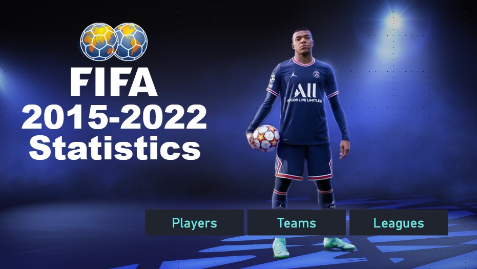
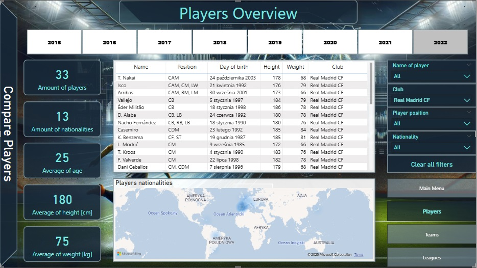
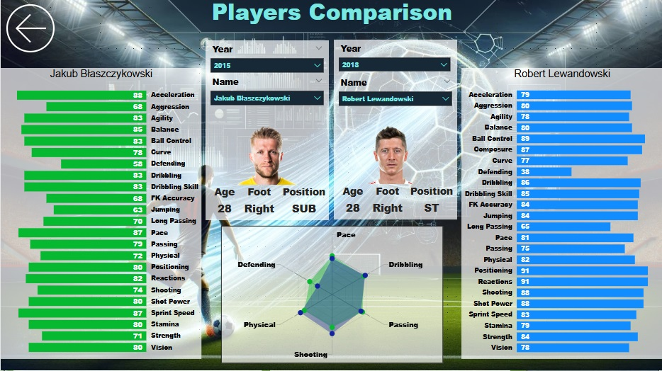
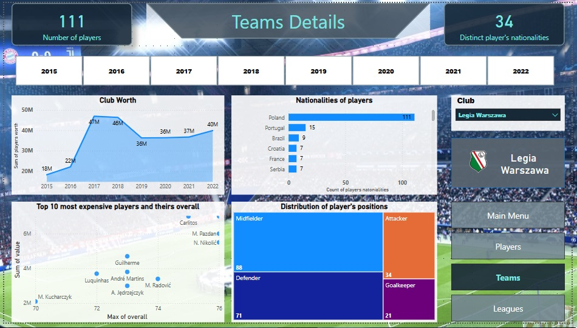
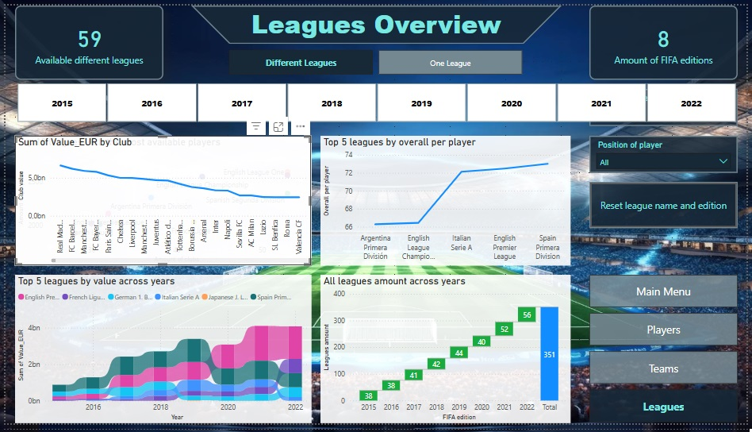
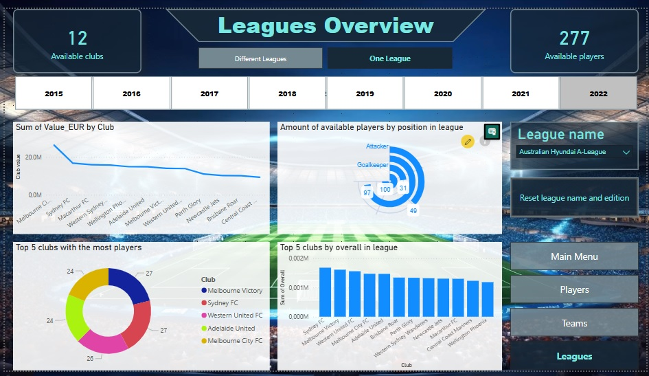
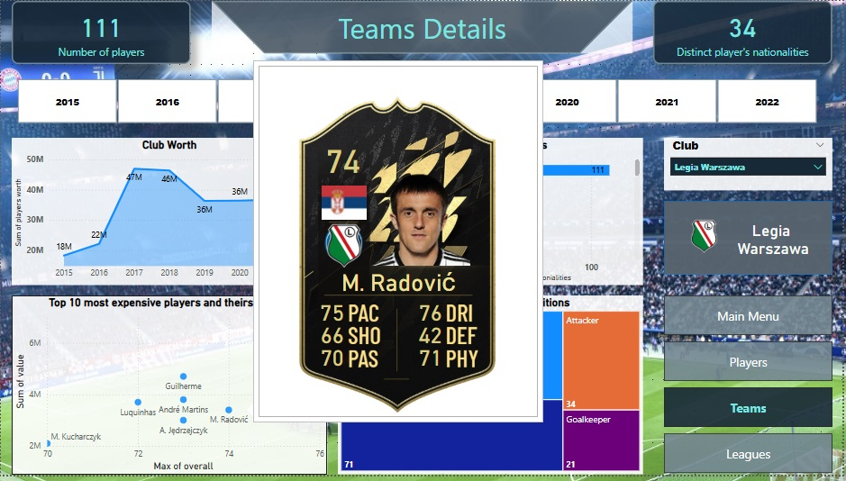

[EN]
___________
### Report 1 - Project on the found dataset
- a five-page project with a summary of available footballers, clubs and leagues in the FIFA game in the 2016-2021 editions,
- unfortunately, because the report file is too large (90GB and GitHub allows a maximum of 25GB), only screenshots are in this directory,
- first page - main menu with navigation to other pages,

- second page - summary of footballers - two bookmarks - in the first a table with basic information about the footballers and a heat map of nationalities, in the second bookmark - a comparison of statistics of any 2 players,

- third page - teams - one view showing several charts regarding the selected club,

- fourth page - leagues - two bookmarks - in the first several views regarding statistics between all leagues available in the game, in the second bookmark - a close-up of selected information about 1 selected league,

- fifth page - a tooltip looking like a footballer card from the FIFA game - it is displayed in some places in the project after hovering over the player's name.

  [PL]
  _________
  ### Raport 1 - Projekt na znalezionym zbiorze danych 
- pięciostronnicowy projekt z podsumowaniem dostępnych piłkarzy, klubów i lig w grze FIFA w edycjach 2016-2021,
- niestety, ponieważ plik z raportem jest zbyt duży  (90GB a GitHub dopuszcza max 25GB) w tym folderze znajdują się tylko screeny,
- pierwsza strona - menu główne z nawigacją do pozostałych stron,

- druga strona - podsumowanie piłkarzy - dwa bookmarki - w pierwszym tabela z podstawowymi informacjami o piłkarzach i mapa cieplna narodowości, w drugim bookmarku - porównywarka statystyk dowolnych 2 zawodników,

- trzecia strona - drużyny - jeden widok przedstawiający kilka wykresów dotyczących wybranego klubu,

- czwarta strona - ligi - dwa bookmarki - w pierwszym kilka widoków dotyczących statystyk pomiędzy wszystkimi dostępnymi w grze ligami, w drugim bookmarku - przybliżenie wybranych informacji na temat 1 wybranej ligii,

- piąta strona - tooltip wyglądający jak karta piłkarza z gry FIFA - wyświetla się ona w niektórych miejscach projektu po najechaniu na nazwisko piłkarza.

