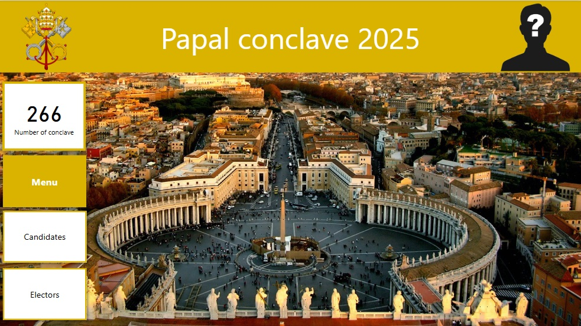
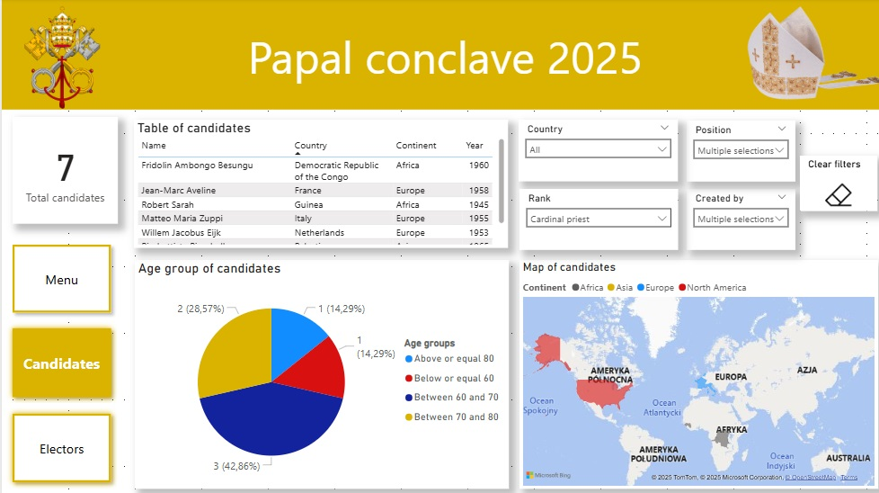
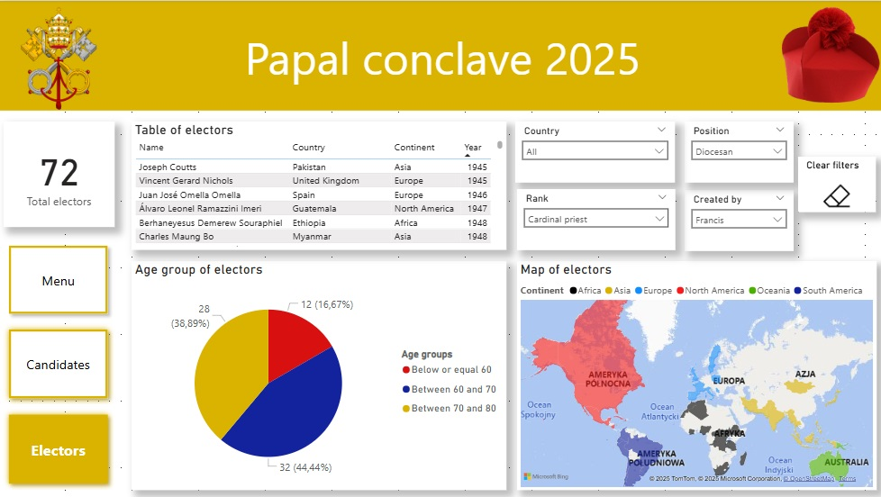
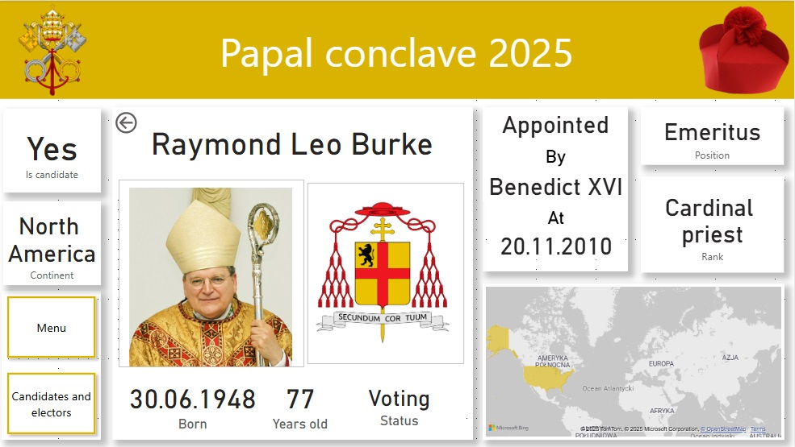

[EN]
_______
### Report 2 - Conclave 2025
- a three-page review of the electors and media candidates for the new pope.
- first page - main menu with navigation to other pages,
  

- second page - cardinals - two bookmarks - the first one displays selected information about all cardinals with the right to vote (electors),
  

- the second one visualizes the figures chosen by the media as the main candidates for the position of pope,
  

- third page - drillthrough - after selecting the selected elector from the table on the previous page, you can move to the drillthrough view showing information about this one, picked beore, cardinal.
  

[PL]
____
### Raport 2 - Conclave 2025
- trzystronnicowy przegląd elektorów i medialnych kandydatów na nowego papieża.
- pierwsza strona - menu główne z nawigacją do pozostałych stron,
  

- druga strona - kardynałowie - dwa bookmarki - w pierwszym z nich są wizualizacje skupiające się na sylwetkach typowanych przed media na głównych kandydatów na stanowisko papieża,
  

-a w drugim - jest podobny widok, tylko że umożliwiający analizę kardynałów z prawem głosu (elektorów),

- trzecia strona - drillthrough - po wybraniu z tabeli na poprzedniej stronie wybranego elektora można przenieść się do widoku drillthrough ukazującego wybrane szczegóły na temat tego jednego kardynała.
  

