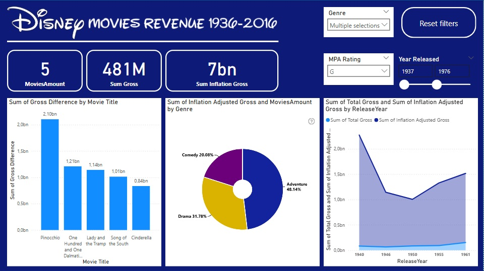

[EN]
________________
### Report 6 - Disney Films 1936-2016
- a one-sided report showing the income from various Disney productions from 1936 to 2016 inclusive.
- the most important graph is the comparison of the "income" and "income adjusted for inflation" columns, which allows for a comparison of the success of productions from different years.

[PL]
_______________
### Raport 6 - Filmy Disneya 1936-2016
- jednostronnicowy raport przedstawiajacy dochody z różnych produkcji firmy Disney od roku 1936 do 2016 włącznie.
- najważniejszym wykresem jest porównanie kolumny "dochód" i "dochód z uwzględnieniem inflacji", która umożliwia porównanie sukcesu produkcji z różnych lat.

