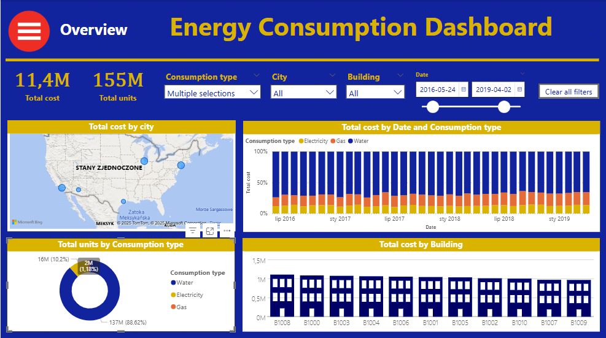
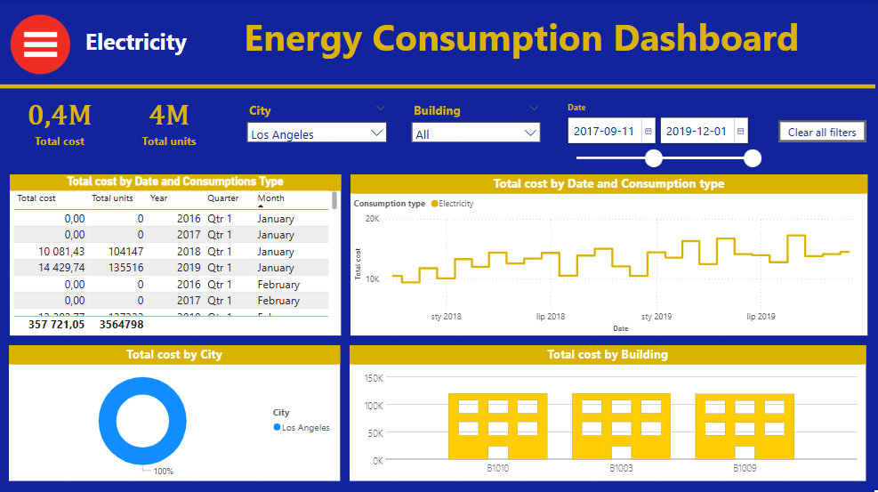
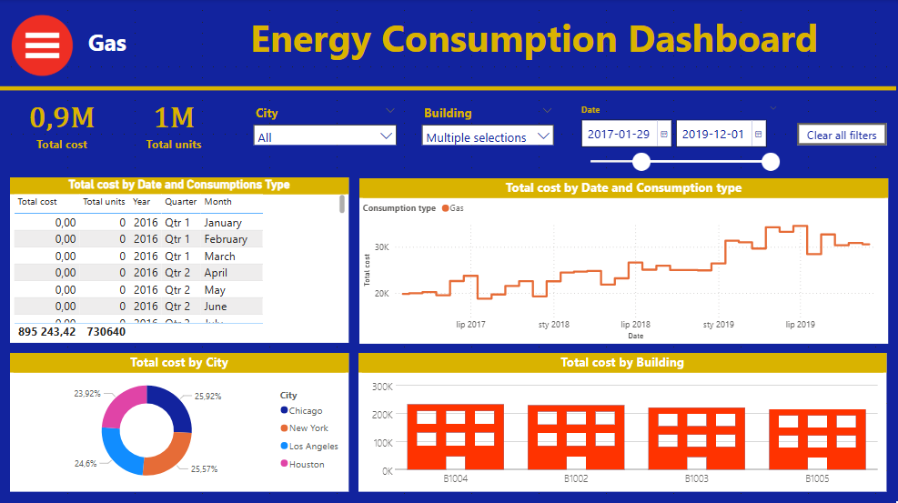
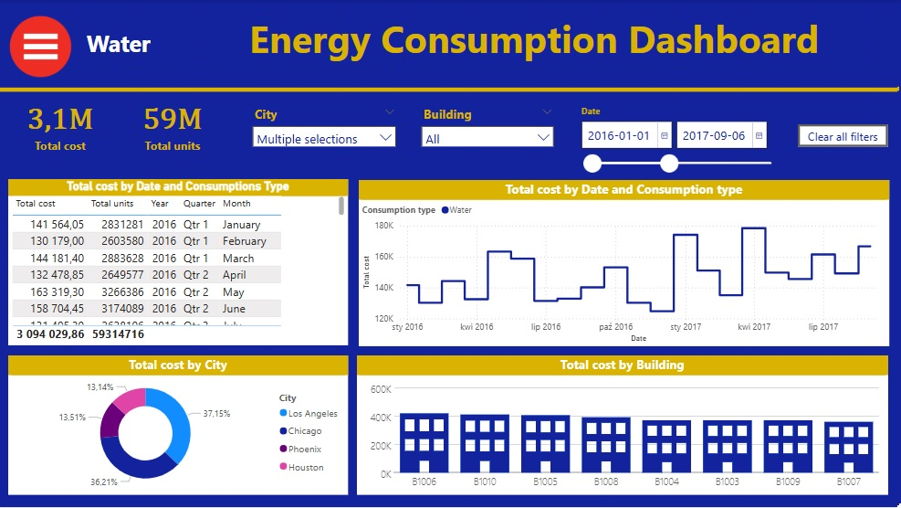
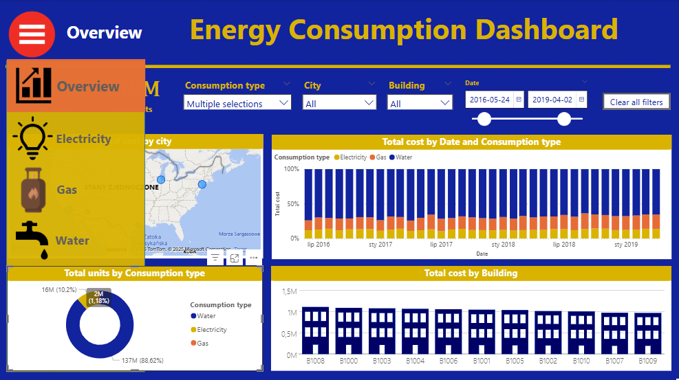

[EN]
__________
### Report 7 - Energy Consumption Dashboard
- A 3-page summary of the consumption of 3 types of energy - water, gas and electricity - by various departments of a certain company.

[PL]
_________
### Raport 7 - Podsumowanie zużycia energii
- 3-stronnicowe podsumowanie zużycia 3 rodzajów energii - wody, gazu i prądu - przez różne oddziały pewnego przedsiębiorstwa.

